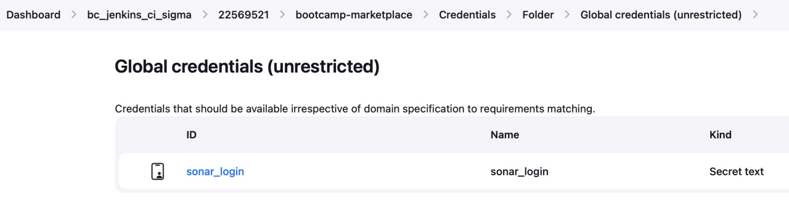
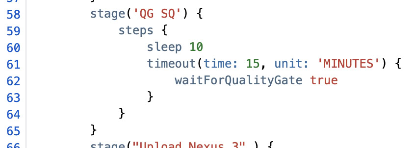

При устройстве в Сбертех мной был пройден подготовительный курс организации, знакомящий с основами DevOps архитектуры в компании. Там я настроила сборку и автоматическое тестирование посредством плагина jacoco простейшего бэкенд-приложения, написанного на Java, проверку покрытия его тестами в SonarQube, настроила Quality Gate-ы этой проверки, после чего собранный дистрибутив моего приложения грузился в хранилище дистрибутивов Nexus и проходил проверки на уязвимости SAST и OSS, а в конце пайплайна вызывалась труба по раскатке дистрибутива моего приложения на тренировочные стенды организации. По согласованию с лектором курса в этом документе я изложу суть этого задания подробнее и приложу удостоверяющие скриншоты из репозитория и трубы в качестве выполнения четвертого ДЗ курса.

Для начала обсудим вкраце само приложение. Оно состоит из двух коротких модулей – ручки на healthcheck и main-а: 

Для этих файлов в репозитории лежат соответствующие тесты:

Чтобы приложение собиралось maven-ом, необходимо, во-первых, положить в корень проекта его конфигурационный файл pom.xml (привожу тут только его часть, здесь подключается spring, junit и jacoco):

Во-вторых, необходимо в корень проекта положить файл settings.xml, в котором описано по каким зеркалам и с какими кредами надо проходить во внутренние репозитории библиотек организации чтобы подтягивать зависимости:

Далее, в самом Jenkinsfile необходимо описать соответствующий стейдж:

Наконец, чтобы Jenkins знал с каким репозиторием работает, необходимо дать права на чтение технической учетной записи Jenkins в настройках самого репозитория, а также корректно настроить Branch Sources в Item-е Jenkins-а при его создании. Для того, чтобы сделать прохождение пайплайна обязательным этапом релиза, необходимо также настроить webhook из Bitbucket-а в Jenkins с установкой параметра Minimum successful build = 1:

Наконец, все настроено, и мы можем видеть в логах трубы, стриггеревшейся на очередной коммит, соответствующее сообщение:

Следующее, чего мы хотим добиться – это сканирование нашего кода инструментом SonarQube, для этого нужно создать свой проект во внутреннем сервисе банка и корректно его настроить, что приводить здесь я не буду, после чего надо выпустить себе токен и добавить его к кредам дженкинса:

После чего достаточно просто поменять Jenkinsfile, и результаты тестирования кода станут видны в созданном нами проекте:

Покрытие тестами относительно низкое, но это только потому, что тестировать там по существу нечего – проект слишком мал. Чтобы сделать достижение дефолтных пороговых показателей необходимым условием для релиза, необходимо также добавить в Jenkinsfile соответствующий стейдж:

Тогда в логах мы увидим соответствующее сообщение о прохождении QG:

Теперь добьемся загрузки дистрибутива нашего приложения в Nexus, для этого необходимо было ранее установить правильно зеркало для соответствующего плагина maven, а также добавить в Jenkinsfile стейдж загрузки в Nexus и стейдж определения версии приложения из номера билда, чтобы при каждой новой сборке, требующей загрузки дистрибутива в нексус (а как описано в стейдже Upload Nexus 3, таковыми являются только сборки из release и hotfix веток), формировалось новое url загрузки:

Теперь в логах трубы можно увидеть сообщение об успешной загрузке дистрибутива в Nexus, а также ссылку на загруженный дистрибутив:

Из проверок, которые требовалось произвести для выпускаемого дистрибутива в этом задании, остаются только проверки SAST и OSS. Первая занимается базовыми проверками на уязвимости статическим анализом кода, а вторая проверяет насколько безопасны наши зависимости. Данные проверки грузят результаты прохождения в отдельный сервис - quality gates manager - в качестве логических флагов, которые подбираются еще одним стейджом - Generate Release Notes, который собирает информацию о дистрибутиве выпускаемого приложения, биндит к ней заведенные задачи в Jira (основываясь на комментариях к коммиту), собирает флаги из сервиса quality gates manager, прикладывает к полученному дистрибутив из nexus и вновь загружает все в quality gates manager. Чтобы заставить работать все вышеперечисленное, надо сложить конфиг-файл для джобов проверки SAST и OSS в корень проекта – файл devseops-config.yml:

И поменять сам Jenkinsfile, добавив в него следующее (функция setFlag и стейджы SAST, OSS проверок и формирования Release Notes):

 
В логах трубы это выльется в соответствующие сообщения об успешном прохождении проверок и формировании release notes:

Наконец, остается только настроить CD процесс, но банке это устроено совсем просто, конечно только если целевая труба деплоймента настроена правильно, в данном случае это требует от нас добавить в Jenkinsfile соответствующий стейдж:

Данная джоба буквально представляет из себя отыгрыш определенных ансибловских плейбуков:

Вот как в итоге выглядит весь наш пайплайн целиком:

